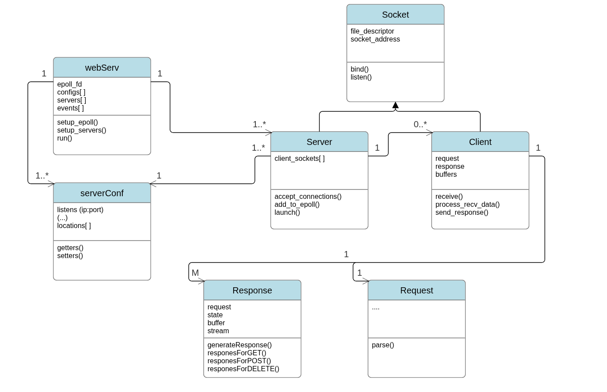
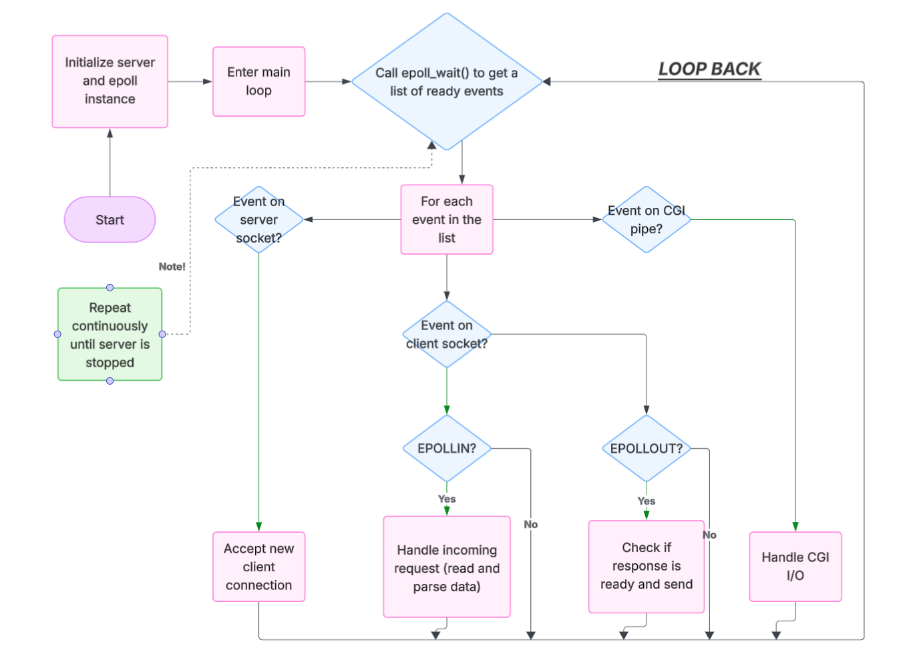
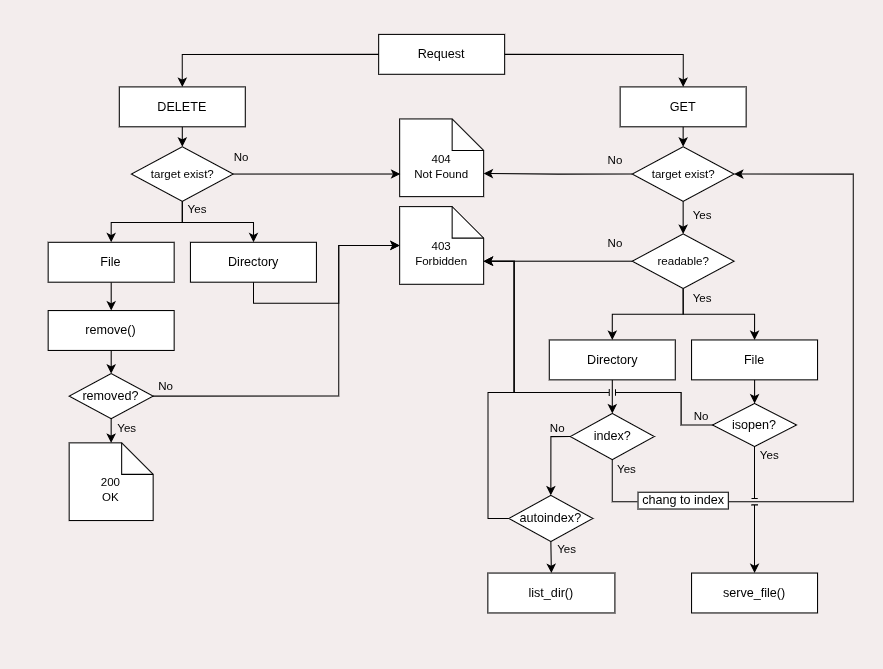
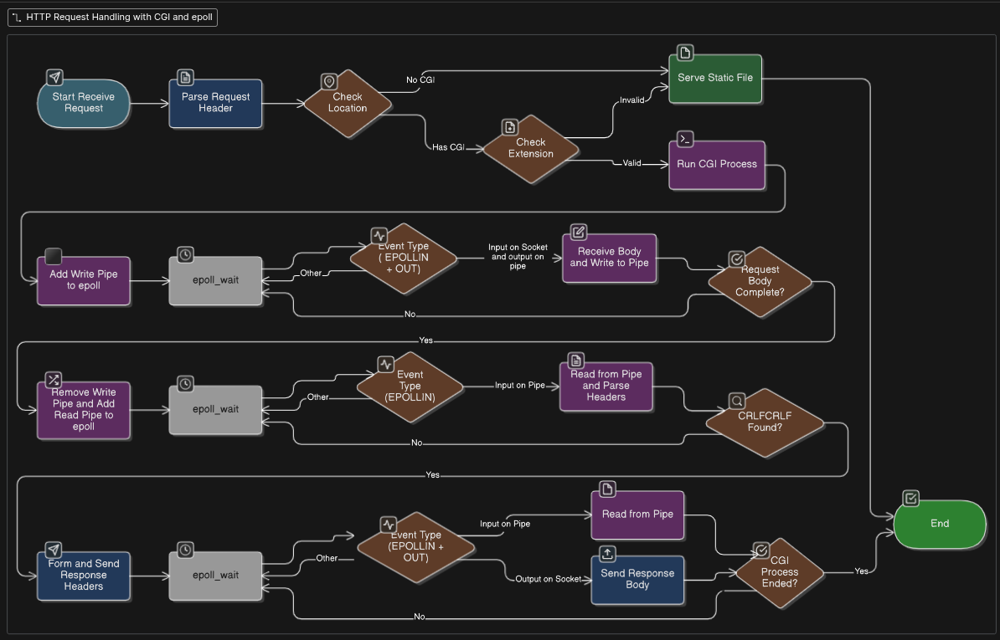

# WebServ

A lightweight HTTP/1.1 web server implementation written in C++98, featuring non-blocking I/O, CGI support, and comprehensive configuration options.

## Class Structure



## 📋 Table of Contents

- [Features](#features)
- [Architecture](#architecture)
- [Requirements](#requirements)
- [Installation](#installation)
- [Usage](#usage)
- [Configuration](#configuration)
- [CGI Support](#cgi-support)
- [Project Structure](#project-structure)
- [Testing](#testing)

## ✨ Features

- **HTTP/1.1 Protocol Support**: Handles GET, POST, and DELETE methods
- **Non-blocking I/O**: Efficient event-driven architecture using `poll()`
- **CGI Integration**: Execute dynamic scripts (Python, PHP, shell scripts)
- **Multiple Virtual Hosts**: Configure multiple servers with different ports
- **Custom Error Pages**: Serve custom HTML pages for error responses
- **File Upload**: Support for multipart/form-data file uploads
- **Directory Listing**: Auto-index for directories
- **Configuration System**: Nginx-style configuration files
- **Request Timeout Handling**: Automatic cleanup of stale connections

## 🏗️ Architecture
### Core Architecture (main loop using epoll)



### Request Processing Flow



The server follows a complete request-response cycle:
1. Socket accepts incoming connections
2. Request parser validates and processes HTTP requests
3. Router determines appropriate handler (static file, CGI, or error)
4. Response builder constructs HTTP response
5. Socket sends response back to client

### CGI Execution Flow



The CGI handler:
1. Validates CGI script existence and permissions
2. Forks a child process for script execution
3. Sets up environment variables (REQUEST_METHOD, QUERY_STRING, etc.)
4. Pipes data between server and CGI script
5. Captures output and constructs HTTP response

## 🔧 Requirements

- C++ compiler with C++98 support (g++, clang++)
- Unix-like operating system (Linux, macOS)
- Make

## 📦 Installation

```bash
# Clone the repository
git clone <repository-url>
cd webserv

# Build the project
make

# Or build and run immediately
make run
```

## 🚀 Usage

### Basic Commands

```bash
# Start server with default configuration
make run

# Start with custom configuration
make run CONFIG_FILE=./conf/example.conf

# Stop the server
make stop

# Restart the server
make restart

# Check server status
make status

# View error logs
make log

# Clean build files
make clean

# Full clean (including executable)
make fclean

# Rebuild from scratch
make re
```

### Manual Execution

```bash
# Run with default config
./webserv

# Run with custom config
./webserv ./conf/test.conf
```

## ⚙️ Configuration

WebServ uses Nginx-style configuration files. Configuration files are located in the `./conf/` directory.

### Configuration Example

```nginx
server {
	# Listen addresses
	listen 127.0.0.1:8080;
	# listen 0.0.0.0:8080; # bind on all interfaces

	# Default error pages
	error_page 400 /err_pages/400.html; # relative path to root
	# ...

	client_max_body_size 106M;
	send_timeout	3;  # time in seconds
	cgi_timeout		3;
	recv_timeout	3;
	root ./www;

	location / {
		index		index.html;
		methods		GET;
		autoindex	off;
	}

	location /large_files {
		root /path/to/override/root;
		autoindex	on;
		methods		GET;
	}

	location /up {
		autoindex		on;
		methods			POST GET;
		upload_store	/path/to/upload;
	}

	location /cgi-bin {
		autoindex on;
		CGI .py /usr/bin/python3;
		CGI .php /usr/bin/php-cgi;
		CGI .cgi /bin/bash;
	}

	location /redirs {
		return 301 https://youtu.be/dQw4w9WgXcQ?si=Faj1lWWybcBb6y3d;
	}
}

```

### Configuration Directives

- **listen**: IP and Port number to bind
- **root**: Document root directory
- **index**: Default index file
- **error_page**: Custom error page mappings
- **client_max_body_size**: Maximum request body size
- **autoindex**: Enable/disable directory listing
- **allowed_methods**: Permitted HTTP methods
- **cgi_pass**: CGI interpreter mappings
- **upload_store**: Directory for file uploads
- **return**: Redirect rules
- **send_timeout**: set response timeout
- **cgi_timeout**: set cgi process timeout
- **recv_timeout**: set response timeout


### Available Configurations

- `default.conf` - Production-almost-ready default configuration
- `example.conf` - Comprehensive configuration example

## 🔌 CGI Support

The server supports Common Gateway Interface (CGI/1.1) for dynamic content generation.

### Supported Script Types

- **Python** (`.py`) - Located in `./www/cgi-bin/`
- **PHP** (`.php`) - Located in `./www/cgi-bin/`
- **Shell Scripts** (`.cgi`) - Located in `./www/cgi-bin/`
- **Etc** - You can test whatever adjust the interpretur in config file

### CGI Scripts Examples

Available test scripts in `./www/cgi-bin/`:
- `hello.py` - Simple Hello World
- `env.py` - Display environment variables
- `params.py` - Query parameter parsing
- `post.py` - Handle POST data
- `upload.php` - File upload handler
- `cookie.py` - Cookie demonstration
- `json.py` - JSON response example

## 📁 Project Structure

```
webserv/
├── src/              # Source code
│   ├── server/       # Core server components
│   ├── req/          # Request parsing
│   ├── resp/         # Response building
│   ├── config/       # Configuration parsing
│   ├── cgi/          # CGI handler
│   ├── uvec/         # Utility vectors
│   ├── include.hpp   # Common includes
│   └── main.cpp      # Entry point
├── conf/             # Configuration files
│   ├── default.conf
│   ├── example.conf
│   └── test.conf
├── www/              # Document root
│   ├── cgi-bin/      # CGI scripts
│   ├── err_pages/    # Error pages
│   ├── uploads/      # Upload directory
│   └── *.html        # Static pages
├── imgs/             # Documentation diagrams
├── obj/              # Build artifacts (generated)
├── Makefile
└── README.md
```

## 🧪 Testing

### Test Pages

Available test pages in `./www/`:
- `index.html` - Main landing page
- `GET.html` - GET method tester
- `POST.html` - POST method tester
- `DELETE.html` - DELETE method tester
- `CGI.html` - CGI functionality tester
- `tester.html` - Comprehensive test suite
- `up/upload.html` - File upload interface

### Manual Testing

```bash
# Start the server
make run

# Test with curl
curl http://localhost:8080/
curl -X POST -d "key=value" http://localhost:8080/cgi-bin/post.py
curl -X DELETE http://localhost:8080/uploads/file.txt

# Test file upload
curl -F "file=@test.txt" http://localhost:8080/cgi-bin/upload.php

# Test with browser
open http://localhost:8080/tester.html
```

### Stress Testing

```bash
# Use siege for load testing
siege -c 100 -t 30s http://localhost:8080/

# Use ab (Apache Bench)
ab -n 1000 -c 10 http://localhost:8080/
```

## 🐛 Debugging

Error logs are written to `error.log` by default:

```bash
# View logs in real-time
tail -f error.log

# View logs using make
make log
```

## 📝 Notes

- The server runs in the background when started with `make run`
- PID is stored in `.webserv.pid` for process management
- Default configuration file: `./conf/default.conf`
- Default listen: localhost:8080
- Maximum connections handled by `poll()` limit

## 🤝 Contributing

This is an educational project implementing HTTP/1.1 server basics. Contributions should maintain C++98 compatibility and follow the existing code style.

## 📄 License

This project is part of the 42 Network curriculum. It is released for educational purposes and may be freely used for learning and testing.

---

**Note**: This server is designed for educational purposes and should not be used in production environments without additional security hardening and feature enhancements.